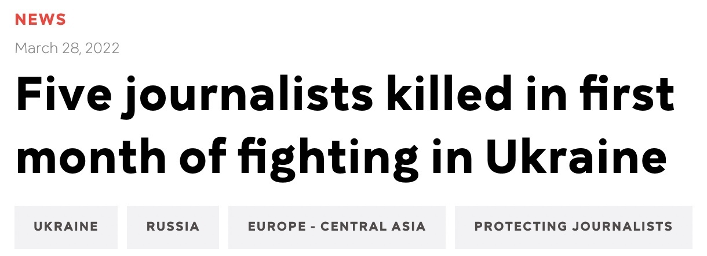

# GPT-2_AutoComplete
## A Context Fine-Tuned, GPT-2 Auto-Completion Text Editor

&nbsp;

Five journalists have been killed in the course of their work in the first month of the 2022 Ukraine War.

I fine-tuned a Hugging Face DistilGPT2 Language Model on a corpus consisting of one week of news articles from the NYT and AP News at the start of the war. The goal is to show a proof-of-concept of a context fine-tuned, text-prediction auto-completion editor for journalists who have to report from the field under trying conditions and severe time pressures.

&nbsp;

---

In the video below, the auto-completion editor is being evaluated on a *NEW* article written by the NYT subsequent to corpus collection. It achieved a Top-10 match of 59%, meaning the writer only needed to type 2 out of every 5 words in the article when writing on a touchscreen device (e.g. phone or tablet). The Top-1 prediction rate was 28%.

&nbsp;

---

The following table shows the results of evaluating the auto-completion engine on three NEW articles written by the NYT subsequent to corpus collection.

| Article | Top-1 %Hit | Top-5 %Hit | Top-10 %Hit |
| --- | --- | --- | --- |
| [new1.txt](https://github.com/ixig/GPT-2_AutoComplete/blob/main/dataset/new/After%20a%20Battering%2C%20Ukraine%20Seeks%20Momentum.txt) | 28% | 51% | 59% |
| [new2.txt](https://github.com/ixig/GPT-2_AutoComplete/blob/main/dataset/new/Bolstering%20Ukraine%20With%20Arms%20That%20Are%20Easy%20to%20Carry%20and%20Simple%20to%20Use.txt) | 28% | 49% | 57% |
| [new3.txt](https://github.com/ixig/GPT-2_AutoComplete/blob/main/dataset/new/Survivors%20Found%20in%20Theater%20Rubble%2C%20but%20Suffering%20Widens.txt) | 27% | 48% | 57% |

&nbsp;

---

The video below shows the auto-completion engine being evaluated on new3.txt -- you can see the distribution of the Top-1/5/10 word hits and what types of words were successfully predicted.

